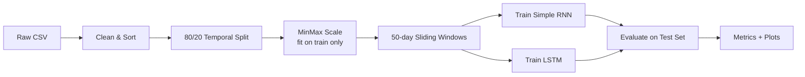
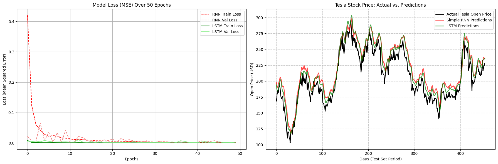

# Tesla Stock Price Prediction

> A deep learning time-series project that forecasts Tesla (TSLA) opening prices using recurrent neural networks — comparing **Simple RNN** and **LSTM** architectures on 10 years of historical market data.

[](https://www.python.org/)
[](https://www.tensorflow.org/)

---

## Table of Contents

- [Overview](#overview)
- [Key Results](#key-results)
- [Dataset](#dataset)
- [Methodology](#methodology)
- [Model Architectures](#model-architectures)
- [Results & Visualizations](#results--visualizations)
- [Project Structure](#project-structure)
- [Getting Started](#getting-started)
- [How to Run](#how-to-run)
- [Limitations & Disclaimer](#limitations--disclaimer)
- [Future Improvements](#future-improvements)

---

## Overview

Financial markets are inherently noisy, yet recurrent neural networks can learn temporal patterns from historical price sequences. This project implements a complete, production-minded machine learning pipeline to predict Tesla's **daily opening price** one step ahead.

The notebook walks through every stage — from data cleaning and leakage-safe preprocessing to model training, evaluation, and side-by-side comparison of two sequence models:

| Model | Description |
|-------|-------------|
| **Simple RNN** | Baseline recurrent network with stacked layers and dropout |
| **LSTM** | Long Short-Term Memory network designed to capture long-range dependencies |

Design choices follow time-series best practices: chronological sorting, train-only scaler fitting, and a strict temporal train/test split to avoid look-ahead bias.

---

## Key Results

On the held-out test set (~20% of data, ~454 trading days), the **LSTM model outperforms the Simple RNN** across all regression metrics:

| Metric | Simple RNN | LSTM | Winner |
|--------|-----------:|-----:|--------|
| **MSE** | 294.45 | **210.32** | LSTM |
| **RMSE** | $17.16 | **$14.50** | LSTM |
| **MAE** | $14.53 | **$12.00** | LSTM |
| **R²** | 0.8057 | **0.8612** | LSTM |

The LSTM achieves **86.1% variance explained** on unseen data, with predictions that closely track actual price movements including major volatility swings.

---

## Dataset

**Source file:** `tsla_stocks.csv`

| Property | Value |
|----------|-------|
| **Ticker** | Tesla, Inc. (TSLA) |
| **Date range** | September 15, 2014 → September 13, 2024 |
| **Records** | 2,517 trading days |
| **Target variable** | `Open` (daily opening price) |

**Columns:**

| Column | Description |
|--------|-------------|
| `Date` | Trading date |
| `Open` | Opening price (USD) — **prediction target** |
| `High` | Daily high |
| `Low` | Daily low |
| `Close/Last` | Closing price |
| `Volume` | Shares traded |

**Preprocessing steps:**
- Parse dates and sort chronologically (oldest → newest)
- Strip currency symbols (`$`) and commas from price fields
- Cast numeric columns to float for model input

---

## Methodology

The pipeline follows a seven-step workflow designed to prevent data leakage and produce reliable out-of-sample evaluation.



### Configuration

| Parameter | Value |
|-----------|-------|
| Lookback window | 50 trading days |
| Train / test split | 80% / 20% (temporal) |
| Scaling | `MinMaxScaler` (0–1), fitted on training data only |
| Training samples | 1,963 sequences |
| Test samples | 454 sequences |
| Epochs | 50 |
| Batch size | 32 |
| Validation split | 10% of training data |
| Optimizer | Adam |
| Loss function | Mean Squared Error (MSE) |

---

## Model Architectures

### Simple RNN (Baseline)

```
Input (50 timesteps × 1 feature)
  → SimpleRNN(50, tanh) + Dropout(0.2)  × 3 stacked layers
  → SimpleRNN(50) + Dropout(0.2)
  → Dense(1)
```

Four stacked SimpleRNN layers with dropout regularization after each block.

### LSTM (Primary Model)

```
Input (50 timesteps × 1 feature)
  → LSTM(64) + Dropout(0.2)
  → LSTM(64) + Dropout(0.2)
  → Dense(32, ReLU)
  → Dense(1)
```

Two LSTM layers with dropout, followed by a small fully connected head.

---

## Results & Visualizations

### Training Convergence

Both models converge within the first few epochs. The LSTM reaches lower and more stable validation loss early, indicating smoother optimization on this sequence length.

### Actual vs. Predicted Prices

On the test period, both models capture the overall trend and major price swings. The LSTM predictions (green) align more closely with actual prices (black), particularly during volatile segments.

<p align="center">
  
</p>

<p align="center"><em>Left: Training & validation loss over 50 epochs. Right: Actual vs. predicted opening prices on the test set.</em></p>

---

## Project Structure

```
tesla-stocks-prediction/
├── README.md                      # Project documentation (this file)
├── requirements.txt               # Python dependencies
├── stock_price_prediction.ipynb   # Full ML pipeline notebook
├── tsla_stocks.csv                # Historical TSLA daily stock data
└── docs/
    └── images/
        └── model_comparison.png   # Evaluation visualizations
```

---

## Getting Started

### Prerequisites

- Python 3.9 or later
- pip

### Installation

1. **Clone the repository**

   ```bash
   git clone https://github.com/your-username/tesla-stocks-prediction.git
   cd tesla-stocks-prediction
   ```

2. **Create and activate a virtual environment** (recommended)

   ```bash
   python -m venv .venv

   # Windows
   .venv\Scripts\activate

   # macOS / Linux
   source .venv/bin/activate
   ```

3. **Install dependencies**

   ```bash
   pip install -r requirements.txt
   ```

---

## How to Run

1. Open `stock_price_prediction.ipynb` in Jupyter Notebook, JupyterLab, or VS Code.
2. Ensure `tsla_stocks.csv` is in the project root (or update the data path in Step 2).
3. Run all cells sequentially from top to bottom.

> **Note:** The notebook was originally written for Google Colab. Change the data path from `/content/tsla_stocks.csv` to a local path such as `tsla_stocks.csv` before running locally.

Expected runtime on CPU: ~5–10 minutes (50 epochs × 2 models).

---

## Limitations & Disclaimer

This project is intended for **educational and research purposes only**. It should not be used as financial advice or for real trading decisions.

- **Single feature:** Only opening price is used; volume and OHLC relationships are ignored.
- **Univariate forecasting:** No external signals (news, macro indicators, sentiment).
- **Market regime shifts:** Models trained on 2014–2024 data may not generalize to future market conditions.
- **Prediction lag:** Like most autoregressive models, predictions can lag behind sharp price reversals.

Always consult qualified financial professionals before making investment decisions.

---

## Future Improvements

- [ ] Incorporate multivariate inputs (Volume, High, Low, Close)
- [ ] Add technical indicators (RSI, MACD, moving averages)
- [ ] Experiment with GRU, Transformer, and attention-based architectures
- [ ] Implement walk-forward validation for more robust evaluation
- [ ] Add hyperparameter tuning (window size, layer depth, learning rate)
- [ ] Deploy as a REST API or interactive dashboard

---

<p align="center">
  Built with Python · TensorFlow/Keras · scikit-learn · pandas
</p>
